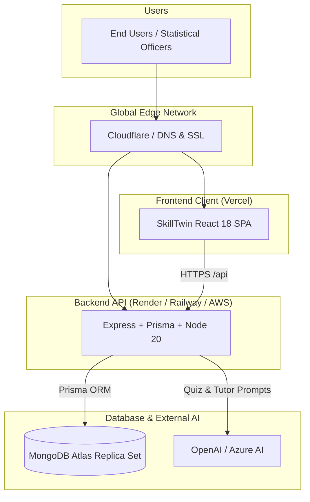

# SkillTwin: Production Deployment Walkthrough

This interactive guide walks you through taking **SkillTwin** from local development into a live, secure production environment.

---

## 🗺️ Architectural Workflow



---

## Phase 1: Database Setup on MongoDB Atlas

### Step 1.1: Create Cluster
1. Navigate to [MongoDB Atlas](https://cloud.mongodb.com) and create an account.
2. Click **Build a Database** $\rightarrow$ select **Shared (M0 Free)** or **Dedicated (M10+)**.
3. Choose your nearest cloud region (e.g., `AWS ap-south-1 Mumbai` for India / MoSPI data sovereignty).
4. Name the cluster: `SkillTwinCluster`.

### Step 1.2: Configure Network & Security
1. Under **Security $\rightarrow$ Database Access**:
   - Click **Add New Database User**.
   - Select **Password Authentication**.
   - Username: `skilltwin_admin`
   - Generate a strong password and save it securely.
   - Built-in Role: `Read and write to any database`.
2. Under **Security $\rightarrow$ Network Access**:
   - Click **Add IP Address**.
   - For cloud platforms with dynamic IPs (Render, Vercel, Railway), add `0.0.0.0/0` (Allow access from anywhere, secured by database credentials).

### Step 1.3: Obtain Connection String
1. In the database dashboard, click **Connect $\rightarrow$ Drivers $\rightarrow$ Node.js**.
2. Copy the URI:
   ```env
   DATABASE_URL="mongodb+srv://skilltwin_admin:<PASSWORD>@skilltwincluster.xxxxx.mongodb.net/skilltwin?retryWrites=true&w=majority"
   ```

---

## Phase 2: Deploy Backend API (Render / Railway)

### Step 2.1: Prepare GitHub Repository
Push your workspace to GitHub if not already done:
```bash
git add .
git commit -m "feat: production deployment configuration"
git push origin main
```

### Step 2.2: Create Render Web Service
1. Log in to [Render Dashboard](https://dashboard.render.com).
2. Click **New + $\rightarrow$ Web Service** and select your GitHub repository.
3. Configure the service settings:
   - **Name**: `skilltwin-api`
   - **Region**: Singapore or nearest
   - **Branch**: `main`
   - **Root Directory**: *(Leave empty to build from repository root)*
   - **Runtime**: `Node`
   - **Build Command**:
     ```bash
     pnpm install --frozen-lockfile && pnpm --filter @skilltwin/types build && pnpm --filter api prisma:generate && pnpm --filter api build
     ```
   - **Start Command**:
     ```bash
     cd apps/api && node dist/main.js
     ```

### Step 2.3: Add Backend Environment Variables
In the Render **Environment** tab, add:

| Key | Value | Note |
| :--- | :--- | :--- |
| `NODE_ENV` | `production` | Enables production optimizations |
| `PORT` | `4000` | Port handled by Render |
| `DATABASE_URL` | `mongodb+srv://skilltwin_admin:...` | From Phase 1 |
| `JWT_SECRET` | *(64-char random string)* | Auth signature secret |
| `JWT_REFRESH_SECRET` | *(64-char random string)* | Refresh token signature |
| `COOKIE_SECRET` | *(32-char random string)* | Session cookie signer |
| `ALLOWED_ORIGINS` | `https://skilltwin.vercel.app` | Your Vercel frontend URL |
| `OPENAI_API_KEY` | `sk-proj-...` | OpenAI or Azure key |

### Step 2.4: Seed Initial Data
Once the service is active, open the **Render Shell** (or run locally with the production `DATABASE_URL`):
```bash
pnpm --filter api prisma:seed
```
This populates MoSPI departments, job roles, competencies, questions, and course catalogs.

---

## Phase 3: Deploy Frontend (Vercel)

### Step 3.1: Connect Vercel Project
1. Log in to [Vercel](https://vercel.com).
2. Click **Add New $\rightarrow$ Project** and import the GitHub repository.
3. In the project configuration:
   - **Framework Preset**: `Vite`
   - **Root Directory**: Click `Edit` and select `apps/web`.
   - **Build Command**: `pnpm build`
   - **Output Directory**: `dist`
   - **Install Command**: `pnpm install`

### Step 3.2: Configure Environment Variables
In the **Environment Variables** section:
- **Key**: `VITE_API_BASE_URL`
- **Value**: `https://skilltwin-api.onrender.com/api` *(Your Render backend URL from Phase 2)*

### Step 3.3: Client-Side Routing Configuration
To guarantee routes like `/skills/:id` or `/courses/:id` do not return 404 on refresh, ensure `apps/web/vercel.json` exists:
```json
{
  "rewrites": [
    { "source": "/(.*)", "destination": "/index.html" }
  ]
}
```
Click **Deploy**! Vercel will build and assign an HTTPS URL (e.g. `https://skilltwin.vercel.app`).

### Step 3.4: Complete the CORS Handshake
Go back to **Render $\rightarrow$ Environment Variables** on your backend:
Update `ALLOWED_ORIGINS` with the exact Vercel URL:
```env
ALLOWED_ORIGINS="https://skilltwin.vercel.app"
```
Render will automatically redeploy with the updated CORS rule.

---

## Phase 4: Alternative Containerized Deployment (Docker + VPS)

If you are hosting on an internal Government cloud, NIC, or a Linux VPS (Ubuntu):

### Step 4.1: Launch Docker Stack
Run the production compose file:
```bash
docker compose -f docker-compose.prod.yml up -d --build
```

### Step 4.2: Reverse Proxy & Automated SSL (Certbot)
Configure Nginx on the host VPS:
```nginx
server {
    server_name skilltwin.gov.in;
    location / {
        proxy_pass http://127.0.0.1:80; # Web container
        proxy_set_header Host $host;
        proxy_set_header X-Real-IP $remote_addr;
    }
}

server {
    server_name api.skilltwin.gov.in;
    location / {
        proxy_pass http://127.0.0.1:4000; # API container
        proxy_set_header Host $host;
        proxy_set_header X-Real-IP $remote_addr;
    }
}
```
Obtain free SSL certificates:
```bash
sudo certbot --nginx -d skilltwin.gov.in -d api.skilltwin.gov.in
```

---

## Phase 5: Verification & Acceptance Testing

Verify the deployed live URL following this operational checklist:

- [ ] **1. Health Check**: Visit `https://<api-domain>/api/health` $\rightarrow$ returns `200 OK`.
- [ ] **2. Auth Flow**: Register a new user at `/register` and test logout/login.
- [ ] **3. SkillTwin Radar**: Check that the radar chart loads dynamic data for the employee role.
- [ ] **4. Action Plan Intelligence**: Click **Action Plan** on any gap (e.g. Python or SQL) and ensure the 4-tier progressive curriculum (Beginner to Master) displays.
- [ ] **5. Generate Learning Path**: Click **Generate AI Learning Path** $\rightarrow$ verify `201 Created` and redirect to `/learning-paths/:id`.
- [ ] **6. Course Streaming**: Open `/courses/:id` $\rightarrow$ verify video player loads, modules tick upon completion, and hook ordering operates error-free.
